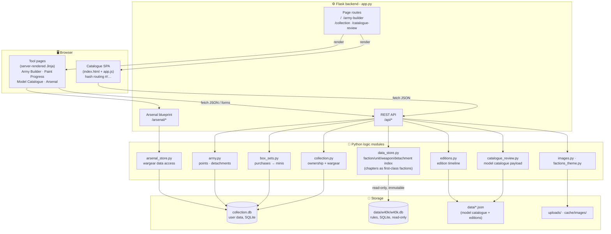
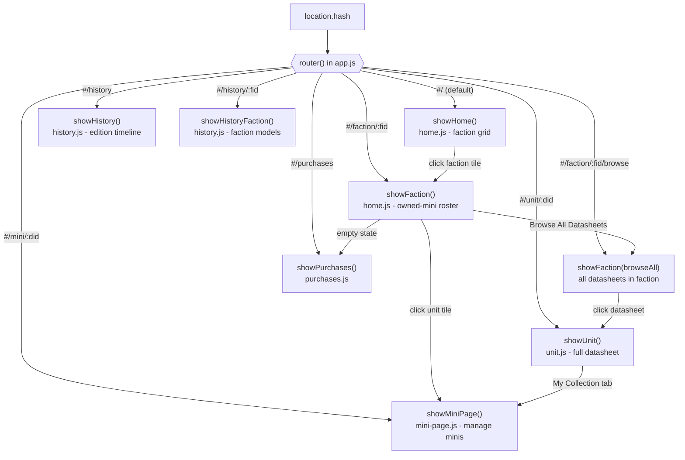
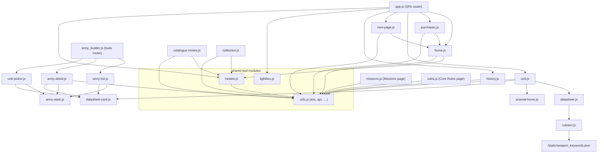
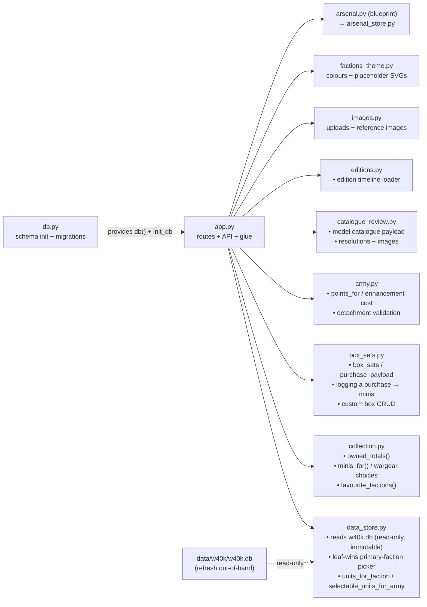
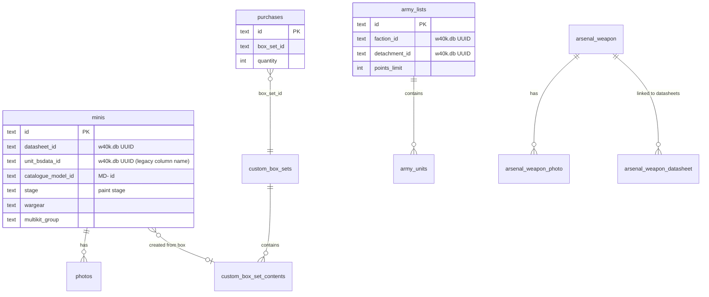
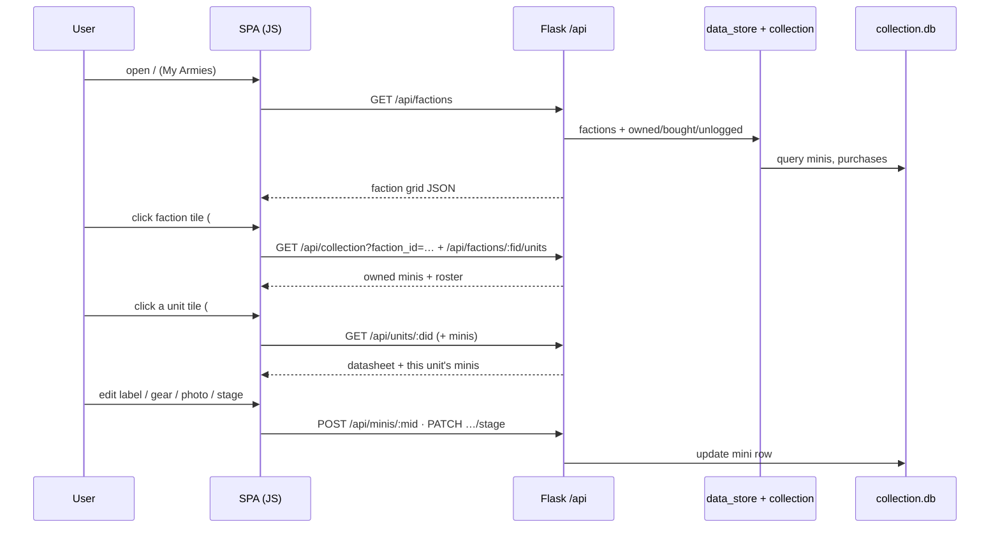
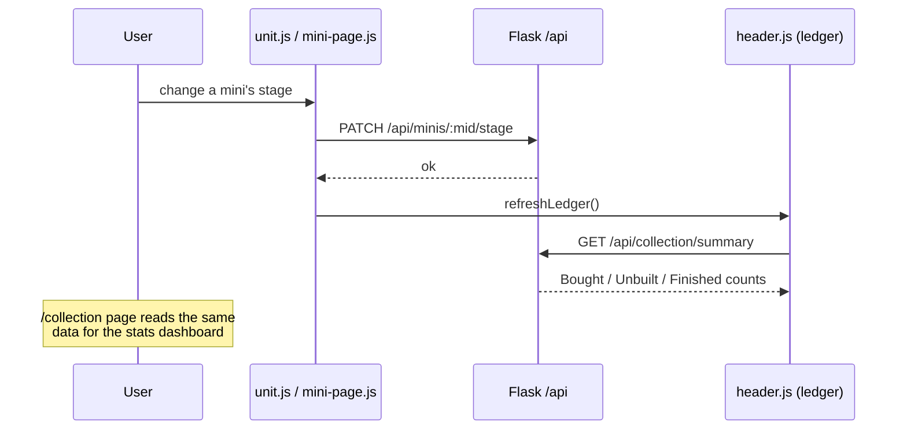
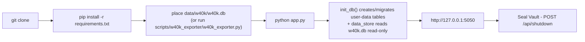

# Codex Armorum: How the App Works (Visual Breakdown)

A walkthrough of the running application - what the pieces are, how they talk to each
other, and what links to what. This is the *behavioural* companion to
[`CODEX_ARMORUM_ARCHITECTURE.md`](CODEX_ARMORUM_ARCHITECTURE.md), which covers the *data
sources, ID systems, and migration rules*. Read this one to understand the request flow;
read that one to understand where the data lives.

> Mermaid diagrams below render natively on GitHub and in most Markdown viewers
> (VS Code with a Mermaid extension, Obsidian, etc.).

---

## 1. The 30-second summary

Codex Armorum is a **single-user, locally-run Flask web app** for cataloguing a
Warhammer 40,000 miniature collection. There is **no build step** and **no frontend
framework** - just vanilla ES modules talking to a Flask REST API, backed by two SQLite
files - `collection.db` (your data, read-write) and `data/w40k/w40k.db` (official rules
data, read-only) - plus hand-curated JSON/markdown reference files in `data/`.

| Layer | Technology | Entry point |
|---|---|---|
| Frontend (catalogue) | Vanilla JS ES modules + hash routing (SPA) | `templates/index.html` → `static/js/app.js` |
| Frontend (tools) | Server-rendered Jinja pages + page-specific JS | `army_builder.html`, `collection.html`, `catalogue_review.html`, `missions.html`, `rules.html`, `arsenal/*` |
| Backend | Flask (`app.py`) + one blueprint (`arsenal.py`) | `python app.py` → `http://127.0.0.1:5050` |
| Data access | Python modules wrapping SQLite + reference files | `data_store.py`, `collection.py`, `box_sets.py`, … |
| Storage | SQLite (`collection.db` user data) + `data/w40k/w40k.db` (rules, read-only) + `data/*.json` (model catalogue + editions) | `db.py` (user-data schema), `data_store.py` (rules loader) |

---

## 2. Big picture - the layered architecture



**Reading it:** the browser only ever talks to Flask over HTTP. Flask routes delegate to
the logic modules. Rules data lives in `data/w40k/w40k.db` and is opened read-only by
`data_store.py` on app start; nothing in `collection.db` mirrors it. User data
(`collection.db`) and the hand-curated catalogue / editions JSON are read at request time
by the logic modules.

---

## 3. Two front ends under one roof

The app has **two distinct frontend styles** that share the same top bar
(`templates/_topbar.html`):

```mermaid
flowchart LR
    subgraph A["SPA shell - index.html"]
        direction TB
        a1["My Armies (home)"]
        a2["Faction roster"]
        a3["Unit datasheet"]
        a4["Mini page"]
        a5["Purchases"]
        a6["Codex Archive"]
    end
    subgraph B["Server-rendered tool pages"]
        direction TB
        b1["Army Builder<br/>army_builder.html"]
        b2["Paint Progress<br/>collection.html"]
        b3["Model Catalogue<br/>catalogue_review.html"]
        b4["Arsenal / Loadouts<br/>arsenal/*.html"]
        b5["Missions<br/>missions.html"]
        b6["Core Rules<br/>rules.html"]
    end
    A -.shared top bar + ledger.- B
```



- **SPA shell** (`/`): one HTML page, content swapped into `<main id="view">` by JS based
  on the URL hash. Handles the core catalogue browsing loop.
- **Tool pages**: each is its own Flask route returning a full Jinja template with its own
  `<script>`. They navigate by real URLs, not hashes.

The top bar links bridge the two worlds (note hash vs. path):

| Nav button | Target | Kind |
|---|---|---|
| **My Armies** | `/` | SPA home |
| **Purchases** | `/#/purchases` | SPA route |
| **Codex Archive** | `/#/history` | SPA route |
| **Paint Progress** | `/collection` | Server page |
| **Army Builder** | `/army-builder` | Server page |
| **Missions** | `/missions` | Server page |
| **Core Rules** | `/rules` | Server page |
| **Weapon Loadouts** | `/arsenal/loadouts` | Blueprint page |
| **Model Catalogue** | `/catalogue-review` | Server page |
| **Seal Vault** | `POST /api/shutdown` | Stops the server |

---

## 4. Client-side routing (the SPA)

`static/js/app.js` is the router. It parses `location.hash` and calls one "show" function:



The **Army Builder** runs its own mini-router (`army_builder.js`) with hashes
`#/army/:aid` for army detail, layered on top of the `/army-builder` server page.

---

## 5. Frontend module graph (what imports what)

Vanilla ES modules, so the import graph *is* the dependency graph. Shared leaf modules
(`utils.js`, `header.js`, `lightbox.js`) are pulled in almost everywhere.



Key roles:

- **`utils.js`** - `esc()`, `api()` (the `fetch` wrapper every call uses), `withTimeout()`,
  contrast-safe colour helper `readableInk()`.
- **`header.js`** - breadcrumb + the live "ledger" (Bought / Unbuilt / Finished counts),
  refreshed via `/api/collection/summary`.
- **`datasheet.js` + `ruletext.js`** - render w40k.db stat blocks, weapons, abilities, and
  wrap weapon keywords with glossary tooltips from `weapon_keywords.json`.
- **`arsenal-hover.js`** - hover popovers on the unit page that pull weapon cards from the
  Arsenal blueprint.
- **`datasheet-card.js`** - the shared full-datasheet profile card (statlines, weapons,
  abilities) rendered by the unit page, the army-builder roster, and the picker preview.
- **`missions.js` / `rules.js`** - standalone page scripts for the `/missions` reference
  and the `/rules` Core Rules reader (fetches `/api/rules`, built by
  `scripts/build_rules.py`).

---

## 6. Backend module responsibilities



| Module | Responsibility | Talks to |
|---|---|---|
| `app.py` | All page routes + the `/api/*` surface; wires everything together | every logic module |
| `data_store.py` | In-memory index of factions/units/weapons/detachments/enhancements read directly from `data/w40k/w40k.db` (UUID ids in `ds_by_id`); leaf-wins primary-faction picker; resolves leader / led-by names | `data/w40k/w40k.db` |
| `collection.py` | Ownership counts, the minis for a datasheet, wargear-choice parsing | `minis` table |
| `box_sets.py` | Box-set definitions, purchase logging that **creates mini rows**, multikit pools | `purchases`, `minis`, `custom_box_*` |
| `army.py` | Army points maths (incl. detachment-gated points tiers), leader attachment, duplicate caps | `data_store` (detachments + enhancements), `wargear` |
| `wargear.py` | Wargear/loadout engine: render schema, defaults, sparse-override persistence, points, legality | `data_store.wargear_loadout` |
| `army_validation.py` | Roster legality engine — structured `{level, code, message}` rows the builder renders | `army`, `data_store` |
| `eligibility.py` | Enhancement eligibility (keyword groups + exported rule flags, Epic Hero bar) | `data_store` |
| `catalogue_review.py` | Builds the Model Catalogue payload, resolves datasheet links via `data_store.ds_by_id` | `data/model_catalogue_*.json` |
| `editions.py` | Loads the hand-curated edition timeline for the Codex Archive | `data/editions_timeline.json` |
| `arsenal.py` / `arsenal_store.py` | The Arsenal (wargear) feature as a self-contained blueprint + its own tables | `arsenal_weapon*` tables |
| `db.py` | Creates/migrates user-data tables, exposes `db()` connection context | `collection.db` |
| `scripts/w40k_exporter/w40k_exporter.py` | Optional: re-exports `w40k.db` from a fresh official-app APK | `base.apk` → `w40k.db` |
| `scripts/migrate_to_app40k.py` | One-shot rewrite of legacy Wahapedia ids in user data to w40k.db UUIDs | `collection.db`, `data/model_catalogue_manual.json` |
| `images.py`, `factions_theme.py`, `utils.py` | Image upload/refs, faction theming, small shared helpers | `cache/`, `uploads/` |

---

## 7. API surface (grouped by feature)

All JSON unless noted. Source: `app.py` route table + the `/arsenal` blueprint.

**Pages (HTML):** `GET /` · `GET /army-builder` · `GET /missions` · `GET /rules` · `GET /catalogue-review` · `GET /collection`

**Factions & units**
- `GET /api/factions` - faction grid with owned/bought/unlogged badges
- `GET /api/factions/<fid>/icon` - tinted faction SVG
- `POST|DELETE /api/factions/<fid>/favourite`
- `GET /api/factions/<fid>/units` - faction roster with collection status
- `GET /api/factions/<fid>/detachments` · `GET /api/detachments/<dtid>/enhancements`
- `GET /api/units/<did>` - the full datasheet payload (stats, weapons, comp, points)
- `GET /api/units/<did>/image` · `GET /api/units/search`

**Collection & minis**
- `GET /api/collection` - minis (optionally `?faction_id=`)
- `GET /api/collection/summary` - the top-bar ledger counts
- `GET /api/unassigned-minis` · `POST /api/minis/assign-datasheet` - the unassigned-minis safety net
- `POST|DELETE /api/minis/<mid>` · `POST /api/minis/<mid>/duplicate`
- `POST /api/minis/<mid>/photos` · `PATCH /api/minis/<mid>/stage` · `GET /api/minis/<mid>/multikit-options`
- `POST /api/units/<did>/wip-notes` · `POST /api/units/<did>/wip-photos` · `DELETE /api/wip-photos/<pid>` - unit-level WIP notes & gallery
- `DELETE /api/photos/<pid>` · `POST /api/photos/<pid>/caption` · `GET /uploads/<fname>`

**Purchases & box sets**
- `GET /api/purchases/page-data` · `GET|POST /api/purchases` · `DELETE /api/purchases/<pid>`
- `GET /api/box-sets` · `POST /api/box-sets` · `POST|DELETE /api/box-sets/<box_id>`
- `POST /api/box-sets/parse` · box-set image + reference endpoints

**Army builder**
- `GET|POST /api/armies` · `GET|POST|DELETE /api/armies/<aid>`
- `POST /api/armies/<aid>/units` · `POST|DELETE /api/army-units/<auid>`
- `GET /api/army-units/<auid>/enhancements` - eligible enhancements for one roster unit
- `GET /api/armies/<aid>/export` · `POST /api/armies/import` - roster round-trip
- `GET /api/battle-sizes` - points / DP / enhancement / duplicate caps per game size

**Reference pages**
- `GET /api/missions` - mission packs, primary/secondary, deployments, layouts, twists
- `GET /api/rules` - the built Core Rules dataset (`data/rules/core_rules.json`; 404s until `scripts/build_rules.py` has run)

**Model catalogue**
- `GET|POST /api/model-catalogue` · `GET|PATCH|DELETE /api/model-catalogue/<id>`
- `GET /api/model-catalogue/faction-cards` - faction tiles for the Codex Archive browser
- `POST /api/model-catalogue/<id>/duplicate` · image endpoints · `GET /api/model-catalogue/search`
- `POST /api/catalogue-review/<id>/resolution`

**Codex Archive**
- `GET /api/editions` - the Warhammer 40,000 edition timeline (powers `/#/history`)

**Arsenal blueprint (`/arsenal/*`, mostly HTML/forms)**
- `GET /arsenal/loadouts` · `GET /arsenal/loadouts/<datasheet_id>`
- `GET|POST /arsenal/weapon/new` · `GET /arsenal/weapon/<id>` · `GET|POST /arsenal/weapon/<id>/edit` · `POST /arsenal/weapon/<id>/delete`
- weapon photo endpoints · `GET /arsenal/api/weapon-card` (the hover card) · `GET /arsenal/audit`

**System:** `POST /api/shutdown` (localhost-only; stops the server)

---

## 8. Data sources & the two ID systems

This is summarised here for orientation; the authoritative version with migration rules is
in [`CODEX_ARMORUM_ARCHITECTURE.md`](CODEX_ARMORUM_ARCHITECTURE.md).

```mermaid
flowchart TB
    subgraph Sources["Two independent data tracks"]
        W40K["1. data/w40k/w40k.db<br/>(SQLite export of the official 40k app)<br/>factions (chapters as real factions) -<br/>units - weapons - points - detachments -<br/>enhancements - leader links"]
        MC["2. Model catalogue + editions JSON<br/>(hand-curated, keep forever)<br/>physical releases + images<br/>+ edition timeline"]
    end

    W40K -->|read-only, immutable| DSS["data_store.ds_by_id<br/>(UUID index)"]
    MC -->|datasheet_links (UUIDs)| DSS

    DSS --> UI["Unit pages - purchase browser -<br/>army builder - arsenal links - Codex Archive"]
```

BSData and Wahapedia are both fully retired: no `bsdata/` repo, no Wahapedia importer, no
runtime alias bridge. Every unit lookup keys on the w40k.db UUID via `ds_by_id`.

The **two ruleset ID systems** (plus the catalogue model id) that everything keys on:

| ID type | Example | Lives on |
|---|---|---|
| w40k.db datasheet UUID | `864734c9-d6c7-4486-92de-9b8271a6a1e5` | `minis.datasheet_id` and `minis.unit_bsdata_id` |
| w40k.db faction UUID | `01623188-9470-4441-96b0-e06eb2572bb5` | `favourite_factions.faction_id`, `custom_box_sets.faction_id`, `army_lists.faction_id` |
| Catalogue model id (`MD-`) | `MD-50836` | `minis.catalogue_model_id`, `custom_box_set_contents.catalogue_model_id` |

> **Legacy column names.** `minis.unit_bsdata_id`, `army_units.unit_bsdata_id`, and
> `arsenal_weapon.weapon_bsdata_id` are a deliberate legacy misnomer kept across the
> w40k.db swap to avoid touching ~30 query sites - they now hold w40k.db UUIDs.
> `minis.datasheet_id` and `minis.unit_bsdata_id` hold the same UUID for every row.
> Space Marine chapters are first-class factions in `w40k.db` (Adeptus Astartes parent
> via `faction.parent_faction`), so there is no chapter-rollup step at load time. See
> [`CODEX_ARMORUM_ARCHITECTURE.md`](CODEX_ARMORUM_ARCHITECTURE.md) for the full reference.

---

## 9. Database schema (entity map)

`db.py` creates a single family of tables in `collection.db`: **user data** (never drop). The
Arsenal owns a second group via `arsenal_store.py`. Rules data lives entirely in `data/w40k/w40k.db`
and is never copied into `collection.db`.



| Group | Tables | Lifecycle |
|---|---|---|
| **User data** | `minis`, `photos`, `unit_wip`, `unit_wip_photos`, `favourite_factions`, `purchases`, `custom_box_sets`, `custom_box_set_contents`, `army_lists`, `army_units` | Back up - never drop |
| **Arsenal** | `arsenal_weapon`, `arsenal_weapon_photo`, `arsenal_weapon_datasheet` | User data |
| **Rules data (external)** | `data/w40k/w40k.db` (`faction`, `datasheet`, `model`, `weapon`, `weapon_profile`, `detachment`, `enhancement`, ...) | Refresh out-of-band; opened read-only |

---

## 10. Key user flows (end to end)

### 10a. Browse: faction → unit → mini



### 10b. Logging a purchase creates minis

```mermaid
sequenceDiagram
    participant U as User
    participant P as purchases.js
    participant API as Flask /api
    participant BOX as box_sets.py
    participant DB as collection.db

    U->>P: pick/define a box set + quantity
    P->>API: POST /api/purchases
    API->>BOX: record purchase
    BOX->>DB: INSERT purchases row
    BOX->>DB: INSERT one minis row per model<br/>(stage='unbuilt', multikit pools where needed)
    API-->>P: updated purchase list + ledger
    Note over P,API: New minis now appear on the<br/>faction roster and Paint Progress
```

### 10c. Paint progress & the live ledger



### 10d. Arsenal - weapons linked to datasheets

```mermaid
sequenceDiagram
    participant U as User
    participant UP as Unit page (unit.js)
    participant AH as arsenal-hover.js
    participant BP as /arsenal blueprint
    participant AS as arsenal_store.py

    U->>UP: hover a weapon name
    UP->>AH: trigger popover
    AH->>BP: GET /arsenal/api/weapon-card
    BP->>AS: look up weapon by name/datasheet
    AS-->>BP: weapon card (profile + photo)
    BP-->>AH: HTML card
    Note over U,BP: /arsenal/loadouts manages weapons;<br/>arsenal_weapon_datasheet links them<br/>to datasheet IDs
```

---

## 11. Lifecycle: from clone to running app



`init_db()` (in `db.py`) runs on startup and is **idempotent** - it creates missing user-data
tables and applies in-place `ALTER TABLE` migrations, so an existing `collection.db` upgrades
cleanly. Refreshing the rules data is a file-drop: replace `data/w40k/w40k.db` and restart.

---

## 12. Where to look when…

| You want to change… | Start in |
|---|---|
| A page's layout / wording | `templates/…` + the matching `static/js/…` module |
| The faction grid or rosters | `home.js` ↔ `app.py` `/api/factions*` |
| How a datasheet renders | `unit.js` + `datasheet.js` + `ruletext.js` |
| How a purchase becomes minis | `box_sets.py` + `purchases.js` |
| Paint stages / progress stats | `collection.js`, `mini-page.js`, `/api/minis/:id/stage`, `/api/collection` |
| Army building & points | `army.py` + `army-*.js` + `unit-picker.js` |
| Roster validation messages | `army_validation.py` (codes) + `army-detail.js` (rendering) |
| Wargear options in the builder | `wargear.py` (engine) + `army-detail.js` (accordion UI) |
| Enhancement eligibility | `eligibility.py` + `/api/army-units/<auid>/enhancements` |
| The Missions reference page | `missions.js` + `/api/missions` -> `data_store._load_missions` |
| The Core Rules page | `rules.js` + `/api/rules` <- `scripts/build_rules.py` <- `data/rules/*.md` |
| Weapon-keyword tooltips | `static/weapon_keywords.json` (order-sensitive) + `ruletext.js` |
| Wargear/weapons (Arsenal) | `arsenal.py` + `arsenal_store.py` + `templates/arsenal/` |
| Unit stats/points source data | `data/w40k/w40k.db` -> `data_store.py` |
| Detachments / enhancements | `data/w40k/w40k.db` (`detachment`, `enhancement`) -> `data_store.py` |
| Physical model releases / images | `catalogue_review.py` + `data/model_catalogue_*.json` |
| The edition timeline (Codex Archive) | `editions.py` + `data/editions_timeline.json` + `history.js` |
| Faction tree / chapter membership | `data_store.faction_parent()` / `is_chapter_faction()` (chapters are real factions in w40k.db) |
| DB schema / a new column | `db.py` (add CREATE + a guarded `ALTER TABLE`) |

---

*Last reviewed: July 2026 (Missions + Core Rules pages, army-builder enforcement
modules). Update this document when routes, frontend modules, or the request flow
change. For data-source and migration details, see
[`CODEX_ARMORUM_ARCHITECTURE.md`](CODEX_ARMORUM_ARCHITECTURE.md); for updating to
a new official-app data version, see
[`CODEX_ARMORUM_DATA_UPDATE.md`](CODEX_ARMORUM_DATA_UPDATE.md).*
